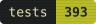
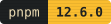
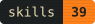
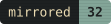

🎞️ the **frame**: a place where most of the machine's setup lives as data.

<p align="center">
  <a href="https://github.com/dvakatsiienko/frame/actions/workflows/ci.yml"></a>
  
  
  
  
  
  
</p>

<p align="center">
  
  
</p>
<br>

### 🧭 toc

- [fleet](#-fleet) — skills, memory, sline, hotkeys
- [chords](#-chords) — the keyboard map, live
- [mirror](#-mirror) — `home/` is `~`
- [machine](#-machine) — brew, defaults, launchd
- [link it](#-link-it) — a fresh mac install

<br clear="right">

## 🛸 fleet

`home/.claude/` is the claude code setup every session reads: memories, rules, skills
(`plugin-x`), hooks, output styles, and `sline`, the statusline.
`cclio/` is the coordinator's home, the session that plans and routes work to background coders.
`hotkeys/` maps every keyboard chord on the machine and serves `chords`, the map's app.
`speak/` reads the selected text aloud on a hotkey and stops on the same key, rewriting ids,
versions, paths and code into something a voice can say.


## 🎹 chords

chords is a keyboard map app: every key binding on every modifier layer, how often each one
fires, and which keys are still free. powered by launchd daemon that counts key presses.


## 🪞 mirror

the `mirror` links dotfiles and configs. a path under `home/` is the same path under `~`.
the link map is derived by walking the tree, so adding a file to `home/` auto-tracks it.

```bash
pnpm frame:link                        # status
pnpm frame:link apply                  # link everything not linked yet
pnpm frame:link register ~/.foo        # move a file into the mirror and link it back
pnpm frame:link untrack ~/.gitconfig   # hand a file back to ~
```


## 💻 machine

the mac's setup is kept as data, because data does not rot and scripts do: the `Brewfile`, the
macos defaults, the `duti` file bindings, and the launchd jobs under `schedule/`.

```bash
pnpm macos:setup   # brew bundle, macos defaults, duti, vim-plug
```

## 🔗 link it

on a fresh machine, install the command line tools first — the clone itself needs git, and macos ships only a shim that opens the install dialog. then clone to `~/frame` and run the seed, or hand it to an agent («seed this mac from frame»):

```bash
xcode-select --install      # stop 0: the dialog, ~2 min
git clone https://github.com/dvakatsiienko/frame ~/frame && cd ~/frame
script/seed.sh                     # command line tools → brew → fnm, pnpm, node → pnpm i → macos:setup → sline → claude cli → frame:link apply
script/seed.sh --claude            # the same, with ~/.claude linked
script/seed.sh --without-appstore  # skip the app store apps and their sign-in
script/seed.sh --dry-run           # what it would do, nothing changed
```

one status line per step, safe to re-run. it stops with `needs your hands: …` (exit 2) where only a human can act — the command line tools dialog, the homebrew password, files in the way of a link, the app store and 1password sign-ins — and the next run picks up from there. when it ends, open a new terminal: a shell opened before the seed never sources the zsh stubs it wrote.
